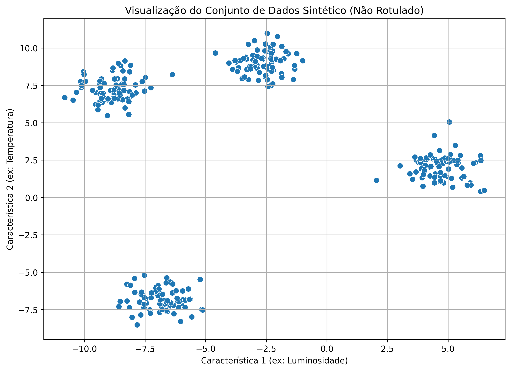
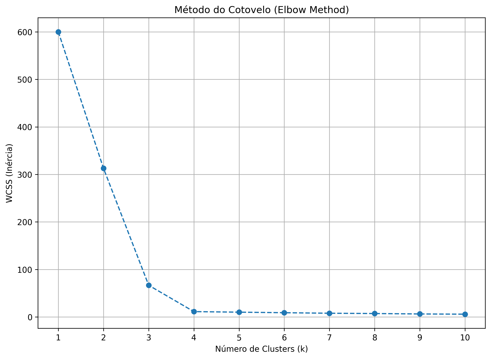
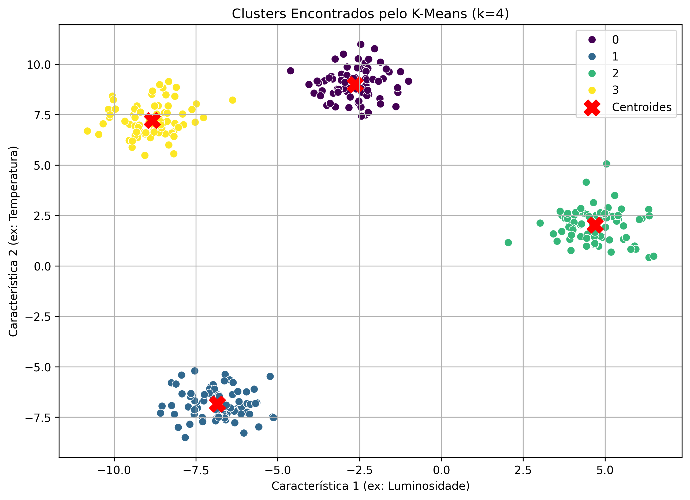

# Relatório Técnico: Agrupamento de Dados com K-Means

**Autor:** Bruno Assis
**Data:** 19 de setembro de 2025
**Projeto:** Análise de Agrupamento com K-Means

---

## 1. Exploração dos Dados

O objetivo deste projeto é aplicar o algoritmo de agrupamento não supervisionado K-Means para identificar clusters distintos em um conjunto de dados. Para esta análise, foi utilizado um dataset sintético de 300 amostras e 2 características, gerado através da função `make_blobs` da biblioteca Scikit-learn. Este dataset simula um cenário onde se busca agrupar corpos celestes com base em duas medições, como luminosidade e temperatura, sem conhecimento prévio de suas classificações.

As estatísticas descritivas não revelam uma estrutura óbvia, mas a análise visual inicial dos dados em um gráfico de dispersão sugere a presença de agrupamentos naturais.

*Figura 1: Gráfico de dispersão das 300 amostras não rotuladas.*

## 2. Pré-processamento

O pré-processamento é uma etapa crítica para algoritmos baseados em distância, como o K-Means. A presença de características em escalas distintas pode enviesar o modelo, atribuindo uma importância desproporcional à característica com maior variância.

Para mitigar este efeito, foi aplicada a técnica de **padronização** utilizando o `StandardScaler` do Scikit-learn. Este processo transforma os dados para que cada característica tenha uma média de 0 e um desvio padrão de 1, garantindo que todas as `features` contribuam de forma equitativa para o cálculo da distância euclidiana. Nenhuma amostra com valor ausente foi identificada.

## 3. Divisão dos Dados

Em problemas de aprendizado não supervisionado, como o agrupamento, o objetivo não é treinar um modelo para prever valores em dados futuros, mas sim descobrir a estrutura latente no conjunto de dados completo. Por essa razão metodológica, a separação tradicional dos dados em conjuntos de treino e teste não foi aplicada. Todo o dataset foi utilizado para a identificação dos clusters, o que é uma prática padrão para este tipo de análise.

## 4. Treinamento do Modelo

A implementação do K-Means requer a definição prévia do número de clusters (k). Para determinar o valor ótimo de `k` de forma empírica, foi utilizado o **Método do Cotovelo (Elbow Method)**. Este método consiste em executar o algoritmo K-Means para um intervalo de valores de `k` (neste caso, de 1 a 10) e calcular a **Soma dos Quadrados Intra-Cluster (WCSS)** para cada iteração.

O gráfico resultante da WCSS versus o número de clusters é então analisado. O "cotovelo" – ponto onde a taxa de diminuição da WCSS se torna marcadamente mais lenta – indica o valor de `k` que representa o melhor equilíbrio entre o número de clusters e a compactação intra-cluster.

*Figura 2: Curva de inércia (WCSS) em função do número de clusters (k).*

A análise do gráfico da Figura 2 revela um "cotovelo" proeminente em **k=4**. A partir deste ponto, adicionar mais clusters não resulta em uma redução significativa da WCSS. Portanto, `k=4` foi selecionado como o número ótimo de clusters para o treinamento do modelo final.

## 5. Avaliação do Modelo

A avaliação do modelo foi realizada por meio de análise visual e quantitativa.

Primeiramente, os clusters identificados pelo algoritmo foram plotados, com cada grupo recebendo uma cor distinta e seus respectivos centroides marcados em vermelho.

*Figura 3: Visualização dos 4 clusters identificados pelo K-Means e seus respectivos centroides.*

A análise visual (Figura 3) demonstra que o algoritmo particionou os dados de forma eficaz, com os quatro clusters claramente definidos e bem separados, alinhados com a estrutura que era sugerida na exploração inicial.

Para uma avaliação quantitativa, foi calculado o **Score de Silhueta (Silhouette Score)**, que mede a qualidade do agrupamento. O score varia de -1 a 1, onde valores mais próximos de 1 indicam que os clusters são densos e bem definidos. O modelo treinado alcançou um **Score de Silhueta de aproximadamente 0.7132**, o que corrobora a alta qualidade do agrupamento e a boa separação entre os clusters.

## 6. Conclusão

Este projeto demonstrou com sucesso a aplicação do algoritmo K-Means para identificar estruturas latentes em um conjunto de dados não rotulado. Através de uma metodologia rigorosa, que incluiu a normalização dos dados e a seleção empírica do número de clusters via Método do Cotovelo, foi possível treinar um modelo que agrupou os dados em 4 clusters distintos e coesos.

A avaliação, tanto visual quanto quantitativa (Score de Silhueta), confirmou a eficácia do modelo. Como possíveis melhorias futuras, sugere-se a aplicação de outros algoritmos de agrupamento, como o DBSCAN ou o Agrupamento Hierárquico, para comparar os resultados e validar a estrutura de cluster encontrada.