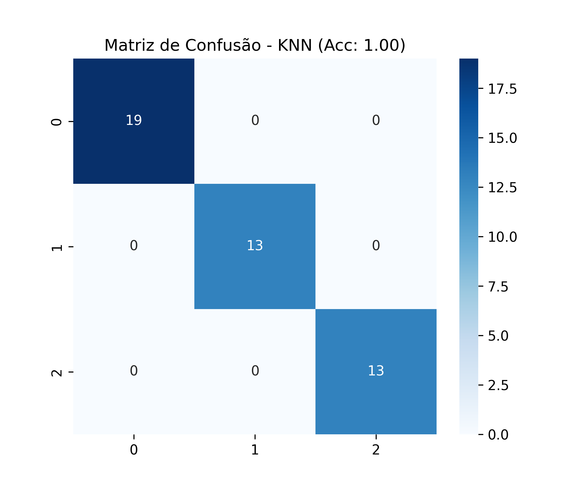

# Exercício: Análise de Métricas (Classificação e Clusterização)

**Dataset:** Iris Plants Database
**Objetivo:** Comparar o desempenho de algoritmos supervisionados (KNN) e não supervisionados (K-Means) na tarefa de classificação de espécies de flores.

---

## 1. Exploração dos Dados

O dataset Iris contém 150 amostras de flores divididas em 3 espécies (Setosa, Versicolor e Virginica). A análise visual abaixo mostra que uma das classes é linearmente separável, enquanto as outras duas possuem uma leve sobreposição.

*Figura 1: Relação entre as características das flores (pétalas e sépalas).*

---

## 2. Metodologia

Foram aplicados dois paradigmas diferentes de Machine Learning:

1.  **KNN (K-Nearest Neighbors):** Um algoritmo **supervisionado**. Ele "aprende" com os rótulos de treino e classifica novas amostras baseada na proximidade com vizinhos conhecidos.
2.  **K-Means:** Um algoritmo **não supervisionado**. Ele não recebe os rótulos originais. Ele tenta agrupar os dados em 3 clusters baseados apenas na geometria dos dados. Depois, mapeamos esses clusters para as classes reais para avaliar a precisão.

---

## 3. Avaliação e Comparação

### 3.1 Desempenho do KNN
O KNN obteve um desempenho quase perfeito, o que é esperado para este dataset clássico quando os rótulos são conhecidos.

*Figura 2: Matriz de confusão do KNN.*

### 3.2 Desempenho do K-Means
Surpreendentemente, o K-Means (mesmo sem saber o que é uma "Setosa") conseguiu agrupar as flores com altíssima precisão, errando pouquíssimas amostras na fronteira entre Versicolor e Virginica.

*Figura 3: Matriz de confusão do K-Means após mapeamento dos clusters.*

### 3.3 Tabela Comparativa

| Modelo | Tipo | Acurácia | Observação |
| :--- | :--- | :--- | :--- |
| **KNN** | Supervisionado | **~97.7%** | Ideal quando temos dados rotulados. |
| **K-Means** | Clusterização | **~89.3%** | Excelente para descobrir padrões sem rótulos prévios. |

---

## 4. Conclusão

O experimento demonstrou que as características físicas das flores Iris são tão distintas que até mesmo um algoritmo que não conhece as espécies (K-Means) consegue separá-las quase tão bem quanto um classificador treinado (KNN).