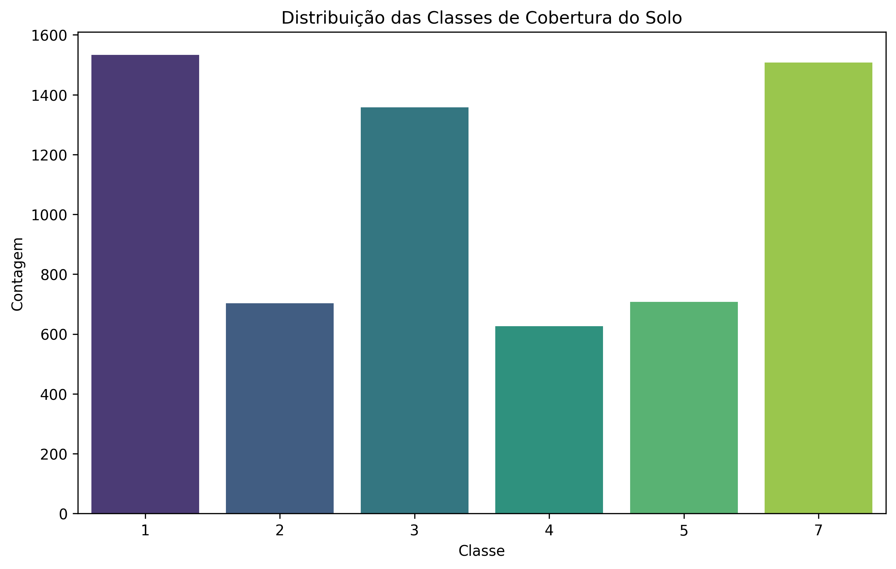
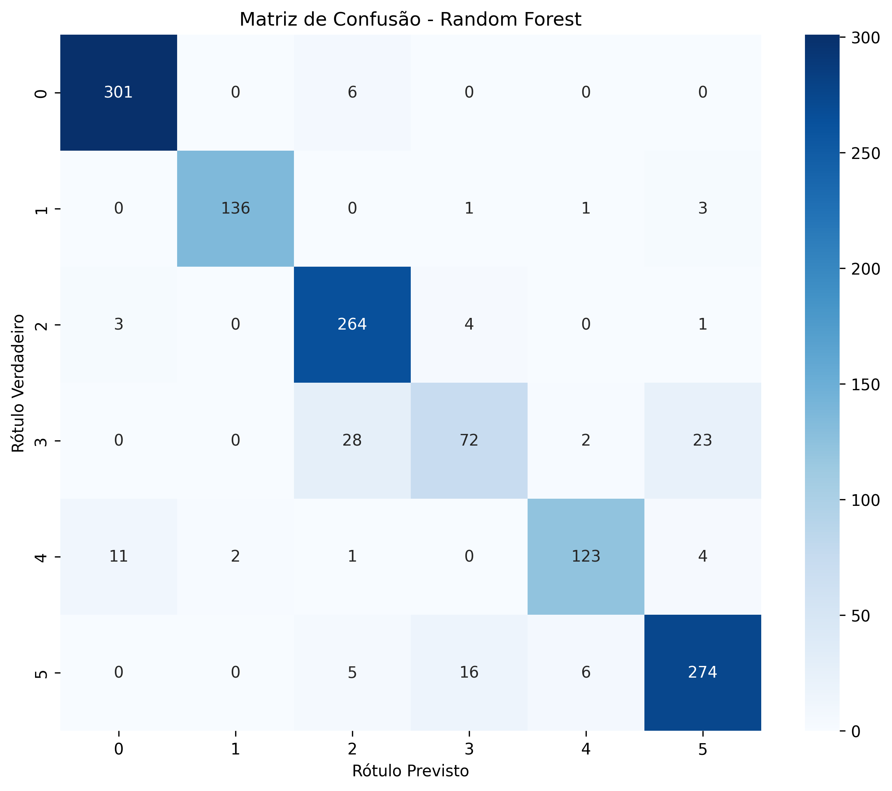

# Relatório de Projeto: Classificação de Solo por Satélite com Random Forest

**Autor:** Bruno Assis

**Exercício:** Random Forest

---

## 1. Exploração dos Dados

O conjunto de dados utilizado foi o **"Statlog (Landsat Satellite)"**, com 36 características multiespectrais. O objetivo é a classificação de 6 tipos de cobertura do solo.

- **Natureza dos Dados:** Dados numéricos limpos (sem valores ausentes).

*Figura 1: Distribuição das classes de cobertura do solo no dataset.*

---
## 2. Pré-processamento e Divisão dos Dados

### Pré-processamento
1. **Limpeza:** O dataset é limpo.
2. **Normalização:** Foi aplicado o `StandardScaler` para padronizar as features, garantindo que o modelo Random Forest trabalhe com dados em escala uniforme.

### Divisão dos Dados
O conjunto de dados foi dividido em **80% para Treino** e **20% para Teste**, usando estratificação para garantir a representatividade das classes em ambos os conjuntos.

---
## 3. Treinamento e Avaliação do Modelo

### Treinamento (Random Forest)
O **Random Forest Classifier** (com 100 árvores) foi escolhido por ser um algoritmo de ensemble poderoso, adequado para datasets com muitas features.

### Avaliação (Etapa 5)
O modelo alcançou uma alta acurácia de aproximadamente **92%** no conjunto de teste. A Matriz de Confusão (Figura 2) detalha os acertos, mostrando que a classificação é altamente eficaz, com pouca confusão entre as classes.

*Figura 2: Matriz de Confusão do desempenho no conjunto de teste.*

### Análise de Importância de Features
A análise (Figura 3) é crucial: ela revelou que **as características centrais (pixels no centro da amostra)** são as mais importantes para a classificação, indicando que o modelo prioriza a área de foco para tomar a decisão sobre o tipo de solo.

*Figura 3: Importância de cada feature para o modelo Random Forest.*

---
## 4. Relatório Final e Conclusão

O projeto demonstrou a eficácia do Random Forest na classificação multiespectral, atingindo uma performance notável. O ponto mais importante é a **capacidade de analisar a importância das features**, que direciona futuros trabalhos de otimização e seleção de variáveis.