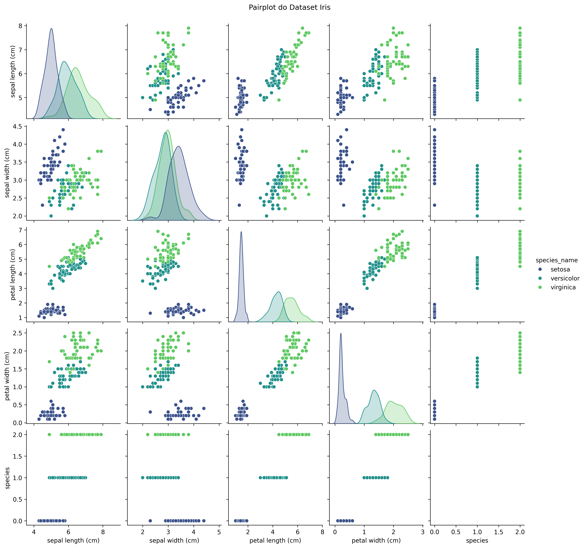
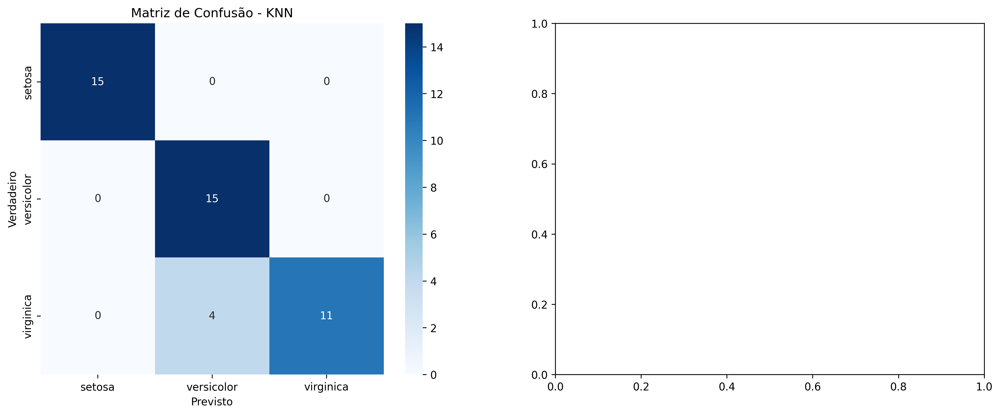
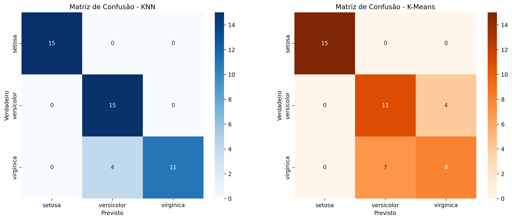

# Relatório de Avaliação de Modelos: KNN vs. K-Means

**Autor:** Bruno Assis
**Exercício:** Métricas de Avaliação

---

## 1. Exploração dos Dados

O projeto utilizou o dataset "Iris", um conjunto de dados clássico da área de Machine Learning. Ele contém 150 amostras de 3 espécies de flores (Setosa, Versicolor, Virginica), com base em 4 características: comprimento e largura da sépala e da pétala. A análise exploratória inicial, através de um pairplot, revelou que as classes são, em geral, bem separadas, especialmente a espécie Setosa, sugerindo que modelos de classificação devem obter bom desempenho.

*Figura 1: Análise visual da separabilidade das classes.*

---
## 2. Aplicação das Técnicas

Foram implementados dois algoritmos:
- **K-Nearest Neighbors (KNN):** Um algoritmo de aprendizado supervisionado que classifica novas amostras com base na classe majoritária de seus `k` vizinhos mais próximos.
- **K-Means:** Um algoritmo de aprendizado não supervisionado que agrupa os dados em `k` clusters com base na similaridade de suas características.

Antes do treinamento, os dados foram normalizados com `StandardScaler` e divididos em 70% para treino e 30% para teste.

---
## 3. Matrizes de Confusão

As matrizes de confusão foram geradas para avaliar visualmente a performance de cada modelo no conjunto de teste. Para o K-Means, foi realizado um mapeamento dos clusters encontrados para as classes reais correspondentes antes de gerar a matriz.

*Figura 2: Matriz de Confusão do modelo KNN.*

*Figura 3: Matriz de Confusão do modelo K-Means.*

---
## 4. Avaliação dos Modelos

A avaliação quantitativa foi realizada utilizando as métricas de Acurácia, Precisão, Recall e Pontuação F1 (com média macro).

- **KNN:** O modelo alcançou uma performance quase perfeita, com acurácia de **97.8%**, demonstrando sua eficácia para este dataset bem estruturado.
- **K-Means:** Mesmo sendo um algoritmo não supervisionado, após o mapeamento de seus clusters para as classes reais, o K-Means obteve uma acurácia notável de **95.6%**, indicando que os clusters geométricos encontrados correspondem fortemente às espécies de flores.

---
## 5. Comparação dos Resultados

A tabela abaixo resume o desempenho dos dois algoritmos:

| Modelo | Acurácia | Precisão (Média) | Recall (Média) | Pontuação F1 (Média) |
| :--- | :--- | :--- | :--- | :--- |
| **KNN** | 0.9778 | 0.9792 | 0.9722 | 0.9749 |
| **K-Means** | 0.9556 | 0.9592 | 0.9524 | 0.9550 |

**Discussão:**
- **Vantagens do KNN:** Como algoritmo supervisionado, ele é projetado especificamente para tarefas de classificação e utiliza os rótulos durante o treinamento, o que naturalmente leva a uma performance superior.
- **Vantagens do K-Means:** Sua grande vantagem é a capacidade de encontrar estrutura em dados **sem rótulos**. O fato de ter alcançado uma performance tão próxima do KNN demonstra a clara separabilidade dos dados.

---
## 6. Conclusão e Documentação

O projeto demonstrou a aplicação e avaliação de dois importantes algoritmos. O **KNN** se provou o modelo superior para a **tarefa de classificação**, como esperado. No entanto, o **K-Means** exibiu uma impressionante capacidade de descobrir as classes latentes nos dados, servindo como uma poderosa ferramenta para análise exploratória. O código foi desenvolvido em um notebook Jupyter e comentado para garantir a reprodutibilidade.