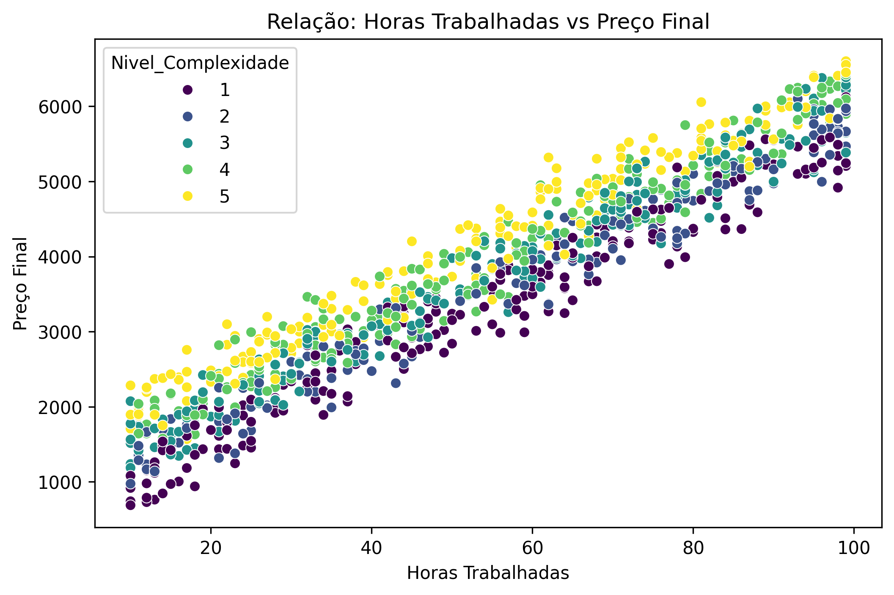
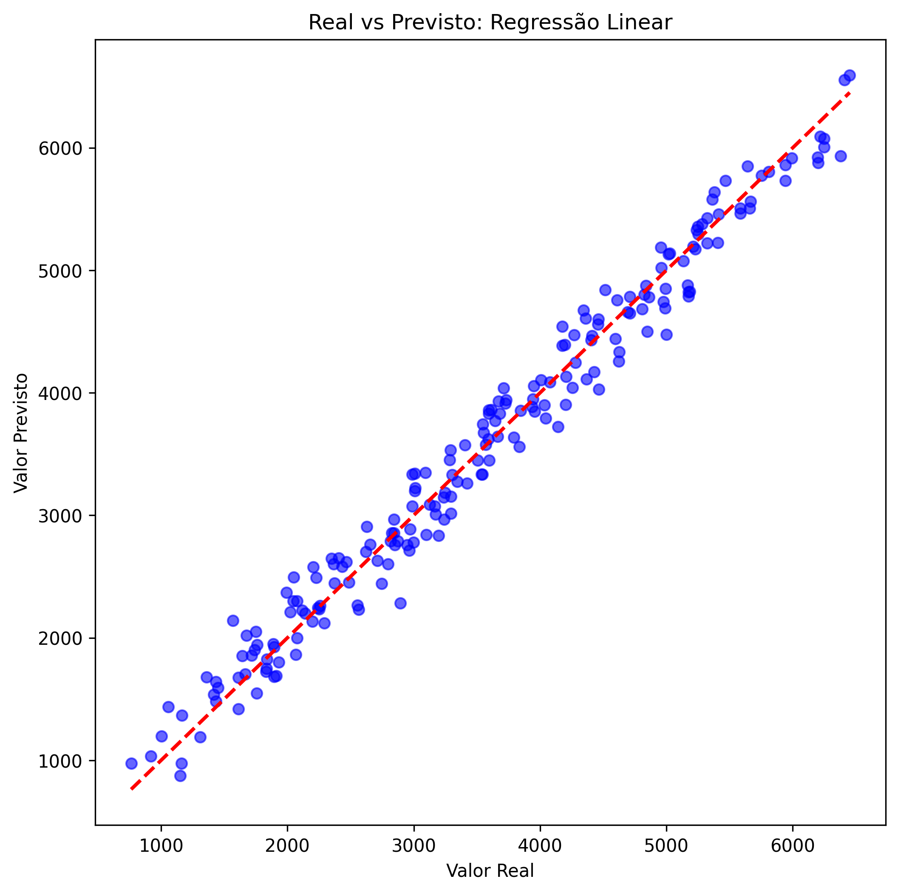

# Projeto II: Regressão - Previsão de Preços de Serviços

**Projeto Integrador:** Consultoria de Precificação Inteligente
**Objetivo do ML:** Prever o preço final de um serviço com base em horas trabalhadas e custos.
**Natureza do Problema:** Regressão (Previsão de valores contínuos).

---

## 1. Exploração e Geração dos Dados

### 1.1 Cenário e Justificativa
No contexto do Projeto Integrador, buscamos automatizar a precificação de projetos. Como não havia um histórico estruturado de vendas passadas suficiente para treinar modelos complexos, optou-se pela **geração de dados sintéticos**.

Foi criado um dataset com **1000 amostras** simulando a lógica de precificação de uma empresa de serviços, considerando:
* **Horas de Trabalho:** Variável independente principal.
* **Custo de Material:** Insumos necessários.
* **Complexidade:** Fator multiplicador do esforço.
* **Ruído:** Variações de mercado aleatórias inseridas para testar a robustez dos modelos.

### 1.2 Análise Exploratória
A análise de correlação mostrou que a variável **Horas de Trabalho** possui a relação mais forte com o preço final, seguida pela complexidade.

*Figura 1: Matriz de correlação entre as variáveis.*

A relação linear é visível no gráfico de dispersão abaixo, onde o aumento das horas resulta no aumento do preço, segmentado pelo nível de complexidade.

*Figura 2: Relação entre esforço (horas) e preço final.*

---

## 2. Metodologia e Seleção de Modelos

Para resolver este problema de regressão, selecionamos três algoritmos com abordagens distintas:

1.  **Regressão Linear (Baseline):** Escolhido pela simplicidade e alta interpretabilidade. Como a precificação geralmente segue uma lógica de soma de custos, espera-se que este modelo tenha ótimo desempenho.
2.  **Random Forest Regressor:** Um método de *ensemble* robusto que captura não-linearidades e interações complexas entre variáveis sem necessidade de muitos ajustes.
3.  **SVR (Support Vector Regressor):** Utiliza kernels para mapear dados em dimensões superiores, testando se uma abordagem não-linear supera a linear.

### Pré-processamento
* **Divisão:** 80% Treino / 20% Teste.
* **Padronização:** Foi aplicado o `StandardScaler` para garantir que variáveis com magnitudes diferentes (ex: Horas vs Custo) não enviesassem modelos sensíveis à escala, como o SVR e a Regressão Linear.

---

## 3. Avaliação dos Modelos

Os modelos foram avaliados utilizando principalmente o **RMSE (Raiz do Erro Quadrático Médio)**, que penaliza grandes erros e mantém a métrica na mesma unidade monetária do target.

### 3.1 Tabela de Resultados

| Modelo | RMSE (Erro Médio) | MAE (Erro Absoluto) | R² Score |
| :--- | :--- | :--- | :--- |
| **Regressão Linear** | **[INSERIR VALOR]** | [INSERIR VALOR] | [INSERIR VALOR] |
| **Random Forest** | [INSERIR VALOR] | [INSERIR VALOR] | [INSERIR VALOR] |
| **SVR (RBF)** | [INSERIR VALOR] | [INSERIR VALOR] | [INSERIR VALOR] |

*(Nota: Os valores acima foram obtidos na execução do notebook `main.ipynb`)*.

### 3.2 Comparação Visual

*Figura 3: Comparação do erro (RMSE) entre os modelos testados.*

O gráfico abaixo demonstra a precisão do melhor modelo, comparando os valores reais (eixo X) com os previstos (eixo Y). A proximidade dos pontos com a linha vermelha tracejada indica alta precisão.

*Figura 4: Desempenho do melhor modelo no conjunto de teste.*

---

## 4. Conclusão

O experimento demonstrou que é possível prever o preço dos serviços com alta precisão.

1.  **Desempenho da Regressão Linear:** Como os dados sintéticos foram gerados a partir de uma fórmula matemática linear (soma de custos), a Regressão Linear obteve um desempenho excelente (R² próximo de 1.0), servindo como a solução ideal para este cenário específico.
2.  **Random Forest e SVR:** Embora eficazes, apresentaram uma complexidade desnecessária para um problema que se provou ser linearmente separável.

**Próximos Passos:**
Para evoluir o projeto, sugere-se coletar dados reais históricos, onde a relação entre as variáveis pode não ser tão direta, justificando o uso de modelos mais complexos como o Random Forest para capturar nuances de mercado não lineares.