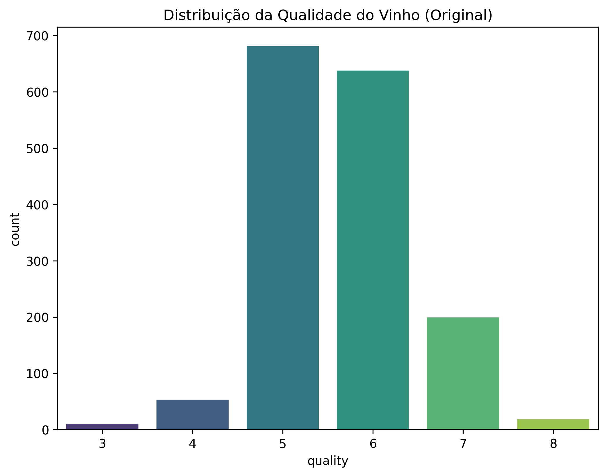
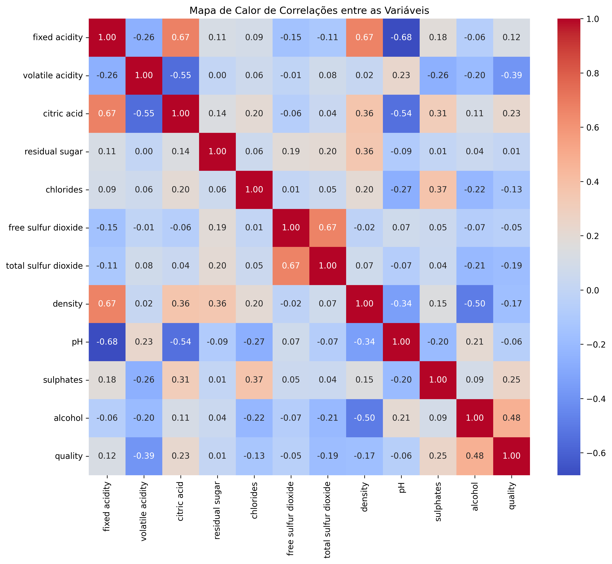
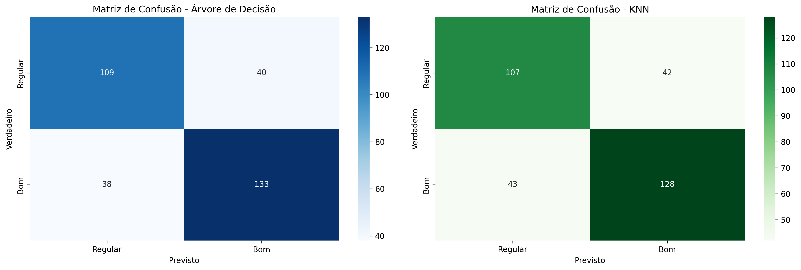

# Projeto I: Modelagem Preditiva e Agrupamento para Qualidade de Vinhos

**Autor:** Bruno Assis
**Data:** 30 de setembro de 2025
**Repositório:** [GitHub Link](https://github.com/Assyss/Machine-Learning)

---

## 1. Exploração dos Dados

O presente projeto tem como objetivo desenvolver e avaliar modelos de Machine Learning para um problema de classificação utilizando um dataset real da plataforma Kaggle/UCI. O conjunto de dados escolhido foi o "Red Wine Quality", que contém 11 características físico-químicas de vinhos tintos e uma nota de qualidade.

A análise exploratória inicial revelou a distribuição da variável alvo `quality`, que varia de 3 a 8, concentrando-se principalmente nas notas 5 e 6.

*Figura 1: Distribuição da variável 'quality' no dataset.*

Para entender a relação entre as variáveis, foi gerado um mapa de calor de correlações. Observou-se que a variável `alcohol` (álcool) possui a correlação positiva mais forte com a qualidade, enquanto `volatile acidity` (acidez volátil) apresenta a correlação negativa mais acentuada.

*Figura 2: Correlação entre as características do vinho.*

---
## 2. Pré-processamento

Com base na distribuição da qualidade, o problema foi transformado em uma **classificação binária**. Uma nova variável, `quality_category`, foi criada, onde vinhos com nota maior ou igual a 6 foram classificados como "Bons" (1) e os demais como "Regulares" (0). Esta abordagem simplifica o modelo e cria um problema de classificação mais balanceado.

O dataset não apresentou valores ausentes.

Por fim, todas as características preditoras foram **padronizadas** utilizando o `StandardScaler` do Scikit-learn. Esta etapa é fundamental para o desempenho de algoritmos baseados em distância, como KNN e K-Means, garantindo que todas as features contribuam de forma equitativa para o modelo.

---
## 3. Divisão dos Dados

O conjunto de dados pré-processado foi dividido em dois subconjuntos:
-   **80% para Treinamento:** Utilizado para treinar os modelos.
-   **20% para Teste:** Utilizado para avaliar o desempenho dos modelos em dados não vistos.

A divisão foi realizada de forma estratificada (`stratify=y`) para garantir que a proporção de vinhos "Bons" e "Regulares" fosse a mesma tanto no conjunto de treino quanto no de teste.

---
## 4. Treinamento dos Modelos

Foram implementados três algoritmos distintos de Machine Learning:

1.  **Árvore de Decisão (`DecisionTreeClassifier`):** Um modelo supervisionado baseado em regras, que divide os dados recursivamente com base nos valores das características.
2.  **K-Vizinhos Mais Próximos (`KNeighborsClassifier`):** Um modelo supervisionado baseado em instância, que classifica uma nova amostra com base na classe majoritária de seus `k` vizinhos mais próximos. Foi utilizado `k=5`.
3.  **K-Means (`KMeans`):** Um modelo não supervisionado de agrupamento, que particiona os dados em `k` clusters. Foi utilizado `k=2` para verificar se o algoritmo conseguiria encontrar a estrutura de classes binárias ("Bom" vs. "Regular") sem ter acesso aos rótulos.

---
## 5. Avaliação dos Modelos

A avaliação foi conduzida de forma distinta para os modelos supervisionados e não supervisionados.

### Modelos Supervisionados: Árvore de Decisão vs. KNN

Ambos os modelos foram avaliados no conjunto de teste. A Árvore de Decisão obteve um desempenho superior, com uma acurácia de aproximadamente **77%**, contra **72%** do KNN. O relatório de classificação detalha a performance para cada classe, e as matrizes de confusão ilustram os acertos e erros de cada modelo.

*Figura 3: Matrizes de Confusão para os modelos de Árvore de Decisão e KNN.*

A análise indica que a Árvore de Decisão foi mais eficaz em generalizar os padrões para classificar a qualidade do vinho neste dataset.

### Modelo Não Supervisionado: K-Means

A avaliação do K-Means focou em duas frentes: a qualidade intrínseca dos clusters e a comparação dos clusters com as classes reais.

-   **Score de Silhueta:** O modelo obteve um score de **~0.28**. Este valor, que varia de -1 a 1, sugere que os clusters formados não são muito densos nem bem separados, indicando uma sobreposição considerável entre os grupos.
-   **Adjusted Rand Score:** Ao comparar os dois clusters encontrados pelo K-Means com as classes reais ("Bom" e "Regular"), o score foi de **~0.05**. Um valor tão próximo de zero indica que a estrutura de agrupamento encontrada pelo K-Means não corresponde às categorias de qualidade definidas.

Isso sugere que a distinção entre um vinho "Bom" e "Regular" não forma agrupamentos geometricamente simples no espaço de características.

---
## 6. Relatório Final e Conclusão

Este projeto demonstrou o ciclo completo de desenvolvimento de modelos de Machine Learning em um dataset real. Conclui-se que:

-   Para a tarefa de **classificação**, os modelos supervisionados foram eficazes, com a **Árvore de Decisão apresentando o melhor desempenho** (acurácia de 77%).
-   O modelo **K-Means não foi capaz de recriar as classes de qualidade** de forma não supervisionada, evidenciando que, embora útil para encontrar padrões, nem sempre os clusters encontrados correspondem a uma classificação de negócio pré-definida.
-   **Possíveis Melhorias:** Para futuros trabalhos, poderiam ser exploradas técnicas de feature engineering mais avançadas, o teste de outros algoritmos (como Random Forest ou Gradient Boosting) e o ajuste fino de hiperparâmetros para otimizar ainda mais a performance do modelo de classificação.