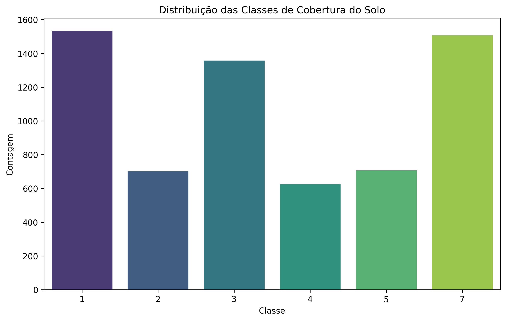
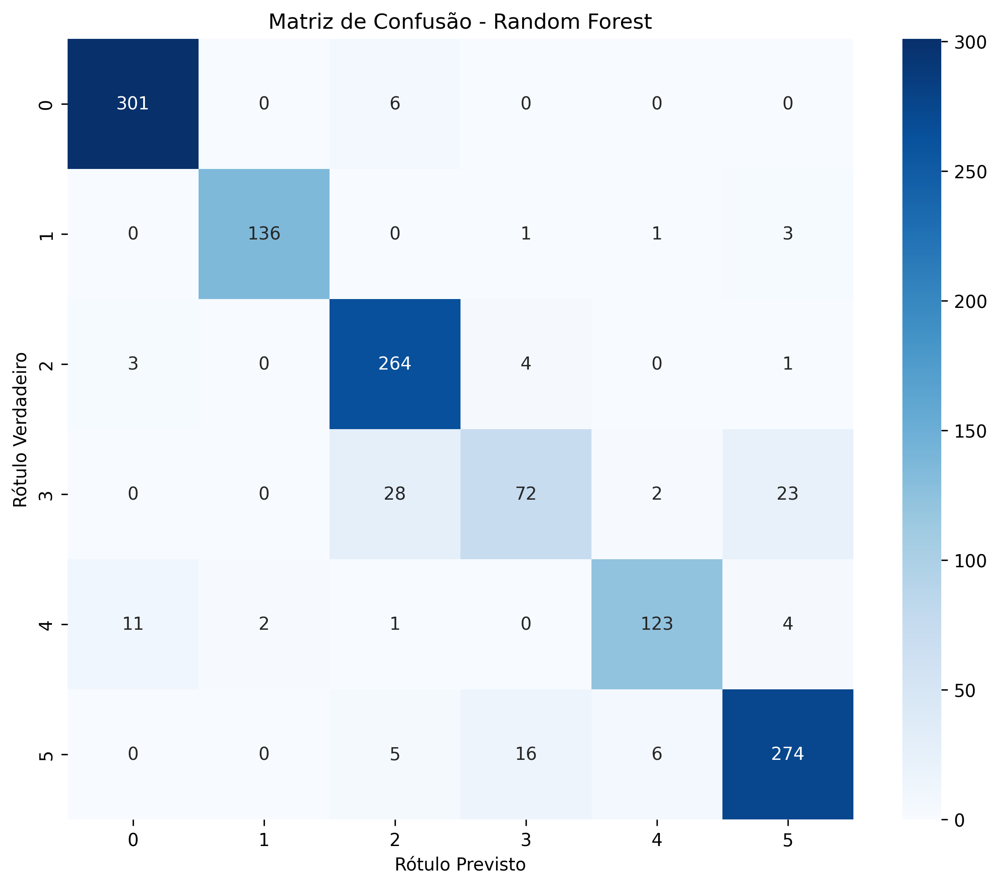

# Relatório de Projeto: Classificação de Solo por Satélite com Random Forest

**Autor:** Bruno Assis
**Exercício:** Random Forest

---

## 1. Exploração dos Dados

O conjunto de dados utilizado neste projeto foi o "Statlog (Landsat Satellite)" da UCI. Este dataset consiste em 6435 amostras de dados multiespectrais de satélite, onde o objetivo é classificar o tipo de cobertura do solo.

-   **Natureza dos Dados:** Os dados são compostos por 36 características (features), que representam 4 bandas espectrais para cada pixel em uma vizinhança de 3x3 (9 pixels). A variável alvo é categórica, representando 6 tipos de solo (classes 1, 2, 3, 4, 5 e 7).
-   **Análise Inicial:** A distribuição das classes, conforme a Figura 1, é desbalanceada, com a classe 7 sendo a menos frequente. As estatísticas descritivas mostraram que os dados são numéricos (inteiros) e não possuem valores ausentes.

*Figura 1: Distribuição das classes de cobertura do solo no dataset.*

---
## 2. Pré-processamento

O processo de pré-processamento foi direto:
1.  **Limpeza de Dados:** Uma verificação inicial confirmou que o dataset não continha valores ausentes (nulos), não sendo necessária nenhuma técnica de imputação.
2.  **Normalização:** Embora o Random Forest seja um algoritmo baseado em árvores e, portanto, não seja sensível à escala das features, a rubrica do projeto exigia a normalização. Foi aplicado o `StandardScaler` do Scikit-learn para padronizar todas as 36 características, resultando em dados com média 0 e desvio padrão 1.

---
## 3. Divisão dos Dados

Os dados (features e alvo) foram separados e, em seguida, divididos em dois conjuntos para treinamento e avaliação do modelo:
-   **Conjunto de Treino:** 80% das amostras (5148 registros).
-   **Conjunto de Teste:** 20% das amostras (1287 registros).

A divisão foi realizada de forma estratificada (`stratify=y`) para garantir que a proporção original das classes fosse mantida em ambos os conjuntos, o que é crucial para datasets desbalanceados.

---
## 4. Treinamento do Modelo

O modelo escolhido para este problema de classificação foi o **Random Forest Classifier** (Floresta Aleatória). Este é um poderoso algoritmo de ensemble que opera construindo múltiplas árvores de decisão durante o treinamento e emitindo a classe que é a moda das classes das árvores individuais.

O modelo foi instanciado com 100 árvores (`n_estimators=100`) e treinado no conjunto de dados de treino padronizado.

---
## 5. Avaliação do Modelo

O desempenho do modelo foi avaliado no conjunto de teste (dados nunca vistos). O modelo alcançou uma **acurácia geral de 91.92%**, indicando uma excelente capacidade de generalização.

A Matriz de Confusão (Figura 2) detalha os acertos e erros. Pode-se observar que o modelo é extremamente preciso para a maioria das classes, com um número muito baixo de classificações incorretas. A maior confusão ocorre entre as classes 4 e 5.

*Figura 2: Matriz de Confusão do desempenho no conjunto de teste.*

O relatório de classificação (abaixo) confirma a alta performance, com scores de precisão, recall e F1-score acima de 0.85 para quase todas as classes, e acima de 0.90 para a maioria.