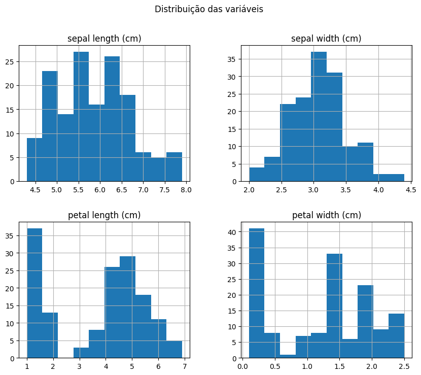

<table border="1" class="dataframe">
  <thead>
    <tr style="text-align: right;">
      <th></th>
      <th>sepal length (cm)</th>
      <th>sepal width (cm)</th>
      <th>petal length (cm)</th>
      <th>petal width (cm)</th>
    </tr>
  </thead>
  <tbody>
    <tr>
      <th>0</th>
      <td>5.1</td>
      <td>3.5</td>
      <td>1.4</td>
      <td>0.2</td>
    </tr>
    <tr>
      <th>1</th>
      <td>4.9</td>
      <td>3.0</td>
      <td>1.4</td>
      <td>0.2</td>
    </tr>
    <tr>
      <th>2</th>
      <td>4.7</td>
      <td>3.2</td>
      <td>1.3</td>
      <td>0.2</td>
    </tr>
    <tr>
      <th>3</th>
      <td>4.6</td>
      <td>3.1</td>
      <td>1.5</td>
      <td>0.2</td>
    </tr>
    <tr>
      <th>4</th>
      <td>5.0</td>
      <td>3.6</td>
      <td>1.4</td>
      <td>0.2</td>
    </tr>
  </tbody>
</table>

<table id="T_5f575">
  <caption>As 5 Primeiras Amostras do Conjunto de Dados Iris</caption>
  <thead>
    <tr>
      <th class="blank level0" >&nbsp;</th>
      <th id="T_5f575_level0_col0" class="col_heading level0 col0" >sepal length (cm)</th>
      <th id="T_5f575_level0_col1" class="col_heading level0 col1" >sepal width (cm)</th>
      <th id="T_5f575_level0_col2" class="col_heading level0 col2" >petal length (cm)</th>
      <th id="T_5f575_level0_col3" class="col_heading level0 col3" >petal width (cm)</th>
    </tr>
  </thead>
  <tbody>
    <tr>
      <th id="T_5f575_level0_row0" class="row_heading level0 row0" >0</th>
      <td id="T_5f575_row0_col0" class="data row0 col0" >5.10</td>
      <td id="T_5f575_row0_col1" class="data row0 col1" >3.50</td>
      <td id="T_5f575_row0_col2" class="data row0 col2" >1.40</td>
      <td id="T_5f575_row0_col3" class="data row0 col3" >0.20</td>
    </tr>
    <tr>
      <th id="T_5f575_level0_row1" class="row_heading level0 row1" >1</th>
      <td id="T_5f575_row1_col0" class="data row1 col0" >4.90</td>
      <td id="T_5f575_row1_col1" class="data row1 col1" >3.00</td>
      <td id="T_5f575_row1_col2" class="data row1 col2" >1.40</td>
      <td id="T_5f575_row1_col3" class="data row1 col3" >0.20</td>
    </tr>
    <tr>
      <th id="T_5f575_level0_row2" class="row_heading level0 row2" >2</th>
      <td id="T_5f575_row2_col0" class="data row2 col0" >4.70</td>
      <td id="T_5f575_row2_col1" class="data row2 col1" >3.20</td>
      <td id="T_5f575_row2_col2" class="data row2 col2" >1.30</td>
      <td id="T_5f575_row2_col3" class="data row2 col3" >0.20</td>
    </tr>
    <tr>
      <th id="T_5f575_level0_row3" class="row_heading level0 row3" >3</th>
      <td id="T_5f575_row3_col0" class="data row3 col0" >4.60</td>
      <td id="T_5f575_row3_col1" class="data row3 col1" >3.10</td>
      <td id="T_5f575_row3_col2" class="data row3 col2" >1.50</td>
      <td id="T_5f575_row3_col3" class="data row3 col3" >0.20</td>
    </tr>
    <tr>
      <th id="T_5f575_level0_row4" class="row_heading level0 row4" >4</th>
      <td id="T_5f575_row4_col0" class="data row4 col0" >5.00</td>
      <td id="T_5f575_row4_col1" class="data row4 col1" >3.60</td>
      <td id="T_5f575_row4_col2" class="data row4 col2" >1.40</td>
      <td id="T_5f575_row4_col3" class="data row4 col3" >0.20</td>
    </tr>
  </tbody>
</table>

<table border="1" class="dataframe">
  <thead>
    <tr style="text-align: right;">
      <th></th>
      <th>sepal length (cm)</th>
      <th>sepal width (cm)</th>
      <th>petal length (cm)</th>
      <th>petal width (cm)</th>
    </tr>
  </thead>
  <tbody>
    <tr>
      <th>count</th>
      <td>150.000000</td>
      <td>150.000000</td>
      <td>150.000000</td>
      <td>150.000000</td>
    </tr>
    <tr>
      <th>mean</th>
      <td>5.843333</td>
      <td>3.057333</td>
      <td>3.758000</td>
      <td>1.199333</td>
    </tr>
    <tr>
      <th>std</th>
      <td>0.828066</td>
      <td>0.435866</td>
      <td>1.765298</td>
      <td>0.762238</td>
    </tr>
    <tr>
      <th>min</th>
      <td>4.300000</td>
      <td>2.000000</td>
      <td>1.000000</td>
      <td>0.100000</td>
    </tr>
    <tr>
      <th>25%</th>
      <td>5.100000</td>
      <td>2.800000</td>
      <td>1.600000</td>
      <td>0.300000</td>
    </tr>
    <tr>
      <th>50%</th>
      <td>5.800000</td>
      <td>3.000000</td>
      <td>4.350000</td>
      <td>1.300000</td>
    </tr>
    <tr>
      <th>75%</th>
      <td>6.400000</td>
      <td>3.300000</td>
      <td>5.100000</td>
      <td>1.800000</td>
    </tr>
    <tr>
      <th>max</th>
      <td>7.900000</td>
      <td>4.400000</td>
      <td>6.900000</td>
      <td>2.500000</td>
    </tr>
  </tbody>
</table>

    

    

    Tamanho do conjunto de treino: 105 amostras
    Tamanho do conjunto de teste: 45 amostras
    

    Modelo treinado com sucesso!
    

    Acurácia: 0.8888888888888888
    
    Relatório de classificação:
                   precision    recall  f1-score   support
    
          setosa       1.00      1.00      1.00        15
      versicolor       0.81      0.87      0.84        15
       virginica       0.86      0.80      0.83        15
    
        accuracy                           0.89        45
       macro avg       0.89      0.89      0.89        45
    weighted avg       0.89      0.89      0.89        45
    
    

    

    

    

    

