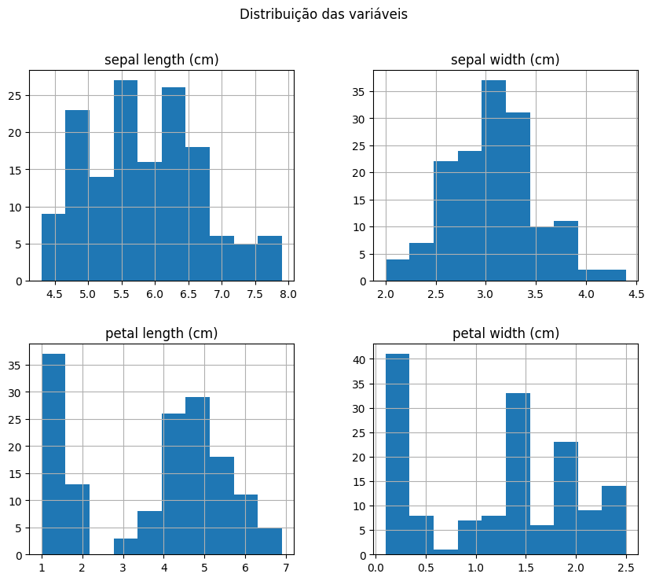
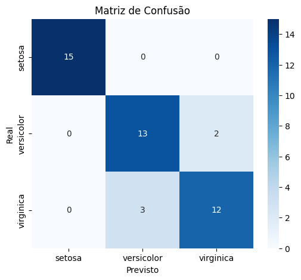
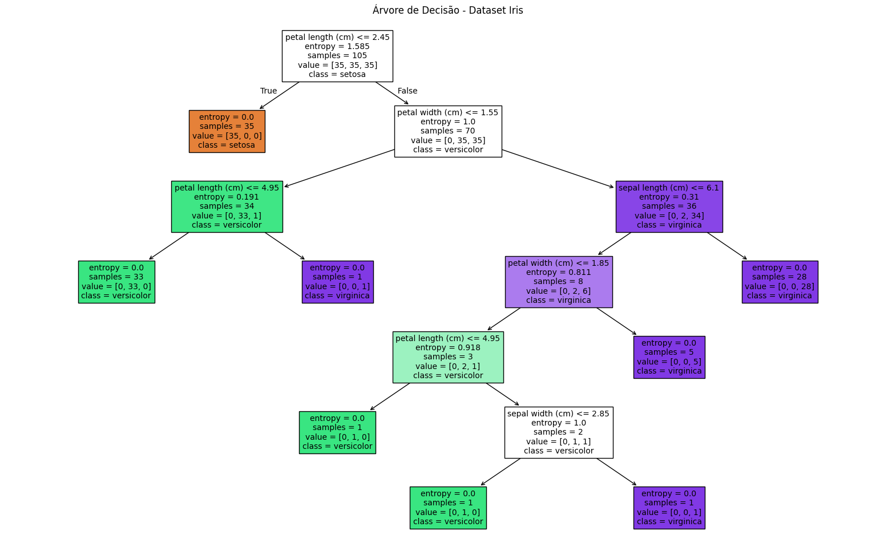

# Projeto de classificação com árvore de decisão: Espécies de flores Iris

**Autor:** Bruno Assis

## Introdução

Este projeto tem como objetivo desenvolver um modelo de Machine Learning capaz de classificar espécies de flores do gênero Iris com base em suas características morfológicas. Para esta tarefa de classificação, foi utilizado o algoritmo de **Árvore de Decisão**, um dos modelos mais intuitivos e poderosos para problemas de classificação.

O desenvolvimento seguiu as etapas de exploração, pré-processamento, divisão dos dados, treinamento e avaliação do modelo, utilizando as bibliotecas `pandas`, `numpy`, `matplotlib` e `scikit-learn`.

---

### Etapa 1: Exploração dos dados

A primeira etapa consistiu em uma análise exploratória para entender a natureza e a estrutura do conjunto de dados Iris.

#### Natureza dos dados

O dataset Iris é um conjunto de dados clássico da área de Machine Learning. Ele contém 150 amostras de flores Iris, divididas igualmente em 3 espécies diferentes:
* **Setosa**
* **Versicolor**
* **Virginica**

Para cada amostra, são fornecidas 4 características (features) em centímetros:
1.  **Comprimento da Sépala** (`sepal length`)
2.  **Largura da Sépala** (`sepal width`)
3.  **Comprimento da Pétala** (`petal length`)
4.  **Largura da Pétala** (`petal width`)

O objetivo do modelo é, a partir dessas 4 medidas, prever corretamente a qual das 3 espécies a flor pertence.

#### Estatísticas descritivas

Uma análise estatística nos ajuda a entender a distribuição e a escala de cada característica. A tabela abaixo resume as principais métricas:

| Métrica | Comprimento da Sépala (cm) | Largura da Sépala (cm) | Comprimento da Pétala (cm) | Largura da Pétala (cm) |
|:--------|:---------------------------|:-----------------------|:---------------------------|:-----------------------|
| count   | 150.00                     | 150.00                 | 150.00                     | 150.00                 |
| mean    | 5.84                       | 3.06                   | 3.76                       | 1.20                   |
| std     | 0.83                       | 0.44                   | 1.77                       | 0.76                   |
| min     | 4.30                       | 2.00                   | 1.00                       | 0.10                   |
| 25%     | 5.10                       | 2.80                   | 1.60                       | 0.30                   |
| 50%     | 5.80                       | 3.00                   | 4.35                       | 1.30                   |
| 75%     | 6.40                       | 3.40                   | 5.10                       | 1.80                   |
| max     | 7.90                       | 4.40                   | 6.90                       | 2.50                   |

A partir da tabela, notamos que as características possuem escalas diferentes (por exemplo, `petal length` varia muito mais que `sepal width`), algo que seria importante para outros algoritmos, mas não tanto para Árvores de Decisão.

#### Visualizações

Os histogramas abaixo mostram a distribuição de cada uma das quatro características. As visualizações são cruciais para identificar quais features são mais promissoras para separar as classes.

*Distribuição das variáveis*

Analisando os gráficos, podemos inferir que o **comprimento e a largura da pétala** (`petal length` e `petal width`) são características muito poderosas para a classificação, pois suas distribuições mostram agrupamentos mais distintos. Já as medidas da sépala (`sepal length` e `sepal width`) apresentam maior sobreposição entre as espécies.

---

### Etapa 2: Pré-processamento

Nesta etapa, preparamos os dados para o treinamento do modelo.

* **Limpeza e Tratamento de Valores Ausentes:** Foi realizada uma verificação de valores nulos ou ausentes no conjunto de dados. O dataset Iris é conhecido por ser completo e limpo, e a análise confirmou que **não havia dados faltantes**, portanto, nenhuma técnica de imputação foi necessária.

* **Normalização:** Modelos baseados em árvores, como a Árvore de Decisão, não são sensíveis à escala das features. Eles tomam decisões baseadas em pontos de corte (ex: "comprimento da pétala < 2.45 cm?"), independentemente de a variável estar em centímetros ou milímetros. Por essa razão, a **normalização ou padronização dos dados não foi uma etapa necessária** para este projeto.

---

### Etapa 3: Divisão dos dados

Para avaliar o modelo de forma justa, o conjunto de dados foi dividido em dois subconjuntos:

1.  **Conjunto de Treino (70% dos dados):** Usado para ensinar o modelo a reconhecer os padrões.
2.  **Conjunto de Teste (30% dos dados):** Usado para avaliar o desempenho do modelo em dados "novos", que ele nunca viu antes.

Utilizamos a função `train_test_split` da biblioteca `scikit-learn`. Um parâmetro crucial utilizado foi a **estratificação** (`stratify=y`). Isso garante que a proporção de cada uma das três espécies de flores seja a mesma tanto no conjunto de treino quanto no de teste, evitando desequilíbrios que poderiam enviesar a avaliação do modelo.

O resultado da divisão foi:
* **Tamanho do conjunto de treino:** 105 amostras
* **Tamanho do conjunto de teste:** 45 amostras

---

### Etapa 4: Treinamento do modelo

O modelo escolhido foi o `DecisionTreeClassifier` da `scikit-learn`.

A implementação consistiu em:
1.  **Instanciar o modelo:** Foi criado um classificador de Árvore de Decisão com o hiperparâmetro `criterion="entropy"`. A entropia é uma métrica baseada em Teoria da Informação que o algoritmo usa para escolher os melhores atributos e pontos de corte para dividir os dados em cada nó da árvore.
2.  **Treinar o modelo:** O modelo foi treinado utilizando o método `.fit()`, que recebe os dados e as classes do conjunto de treino (`X_train`, `y_train`). Durante este processo, o algoritmo constrói a árvore de regras que melhor classifica os dados de treinamento.

---

### Etapa 5: Avaliação do modelo

Após o treinamento, o desempenho do modelo foi avaliado utilizando o conjunto de teste.

#### Métricas de desempenho

A performance foi medida com base nas seguintes métricas:

* **Acurácia:** A proporção de previsões corretas sobre o total de amostras. O modelo atingiu uma **acurácia de aproximadamente 89%**.

* **Relatório de Classificação:** Fornece uma visão detalhada do desempenho para cada classe.

| Classe     | Precision | Recall | F1-Score | Support |
|:-----------|:----------|:-------|:---------|:--------|
| setosa     | 1.00      | 1.00   | 1.00     | 15      |
| versicolor | 0.81      | 0.87   | 0.84     | 15      |
| virginica  | 0.86      | 0.80   | 0.83     | 15      |

Da tabela, concluímos que:
* A classe **setosa** foi perfeitamente classificada (100% em todas as métricas).
* Houve uma pequena confusão entre as classes **versicolor** e **virginica**, que são naturalmente mais parecidas entre si.

#### Matriz de confusão

A Matriz de Confusão nos permite visualizar exatamente onde o modelo acertou e errou.

Análise da matriz:
* **Linha 'setosa'**: 15 foram corretamente previstas como setosa. 0 erros.
* **Linha 'versicolor'**: 13 foram corretamente previstas como versicolor, mas 2 foram incorretamente classificadas como virginica.
* **Linha 'virginica'**: 12 foram corretamente previstas como virginica, mas 3 foram incorretamente classificadas como versicolor.

#### Visualização da Árvore de decisão

A árvore gerada pelo modelo pode ser visualizada para entendermos as regras que ela aprendeu.

A raiz da árvore (`petal length (cm) <= 2.45`) mostra que a característica mais importante para a primeira divisão é o comprimento da pétala, confirmando nossa análise exploratória inicial.

---

### Etapa 6: Relatório final e conclusão

O projeto demonstrou com sucesso a aplicação de um modelo de Árvore de Decisão para um problema de classificação. O modelo alcançou um desempenho robusto, com uma acurácia de **89%** no conjunto de teste, e foi capaz de aprender regras lógicas e interpretáveis para distinguir entre as espécies de flores Iris.

A análise das métricas revelou que o modelo é extremamente eficaz em identificar a espécie `setosa`, mas apresenta uma pequena dificuldade na distinção entre `versicolor` e `virginica`, que são morfologicamente mais similares.

#### Possíveis melhorias
Para aprimorar ainda mais o desempenho do modelo, os seguintes passos poderiam ser explorados:

1.  **Otimização de Hiperparâmetros:** Utilizar técnicas como *Grid Search* ou *Random Search* para encontrar a melhor combinação de hiperparâmetros (como `max_depth` e `min_samples_leaf`), o que pode reduzir o superajuste e melhorar a generalização.
2.  **Validação Cruzada (Cross-Validation):** Empregar a validação cruzada k-fold para obter uma estimativa mais estável e confiável do desempenho do modelo.
3.  **Comparação com Outros Modelos:** Treinar e avaliar outros algoritmos de classificação, como *Random Forest* (que é um conjunto de árvores de decisão), SVM ou Regressão Logística, para comparar os resultados.
4.  **Análise de Importância das Features:** Extrair e visualizar a importância de cada uma das quatro características para entender quais delas mais contribuíram para as decisões do modelo.